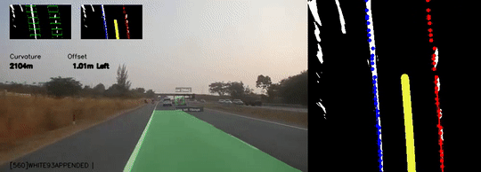
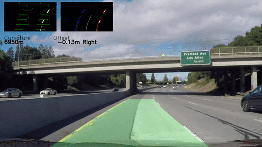
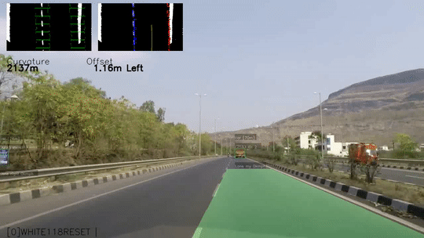

# Copilot : Driving assistance on mobile devices
### Lane and obstacle detection for active assistance during driving.

<br> 
*Vehicle* *Position* *+* *collision* *time* *superposed* *in* *the* *top* *view* 

Imagine having a momentary loss of attention while driving down a highway, and immediately you hone letting off a auditory warning alerting you before you come too close to the vehicle infront. If you are overspeeding a message nudges you to slowdown. After you complete the drive you can see a summary of how safe or rash you have driven during this trip.

Smart phones have come a long way and so have cars. The penetration of autonomous driving features are restricted to the few top end vehicles. An autonomous parking feature can set one back by an additional 5000$ at present and evertime it is recallibrated it can cost someting similar. Less than X% of the vehicles on the road have 

The technology already exists. The challenge is to to make it more accesible. I remember the first time I saw the google maps ad Lets never get lost again. Google maps have since become an intergral part of driving. Voice prompts guiding us to nogotiate the turn, rerouting through a congested arterial road,  makes you wonder how we could do it in the era before the smart phones. Earlier there were GPS end terminals fitted onto the dashboard. At times you had to dial to a tele caller to help you navigate based on your GPS coordinates. Gmaps universal adoption took place over a decade. The transition to a copilot driving assitant should be much faster. 

## DOWNLOAD WEIGHTS AND CODE

```python
! git clone https://github.com/visualbuffer/copilot.git
! mv copilot/* ./
! wget  -P ./model_data/  https://pjreddie.com/media/files/yolov3.weights
! wget -P ./model_data/ https://s3-ap-southeast-1.amazonaws.com/deeplearning-mat/backend.h5
```

<br>
*Robustness* *for* *different* *illumination* *conditions*

## USAGE EXAMPLE
```python
from frame import FRAME

file_path =  "videos/highway.mp4"# <== Upload appropriate file          
video_out = "videos/output11.mov"
frame =  FRAME( 
    ego_vehicle_offset = .15,                       # 
    yellow_lower = np.uint8([ 20, 50,   100]),      # LOWER YELLOW HLS THRESHOLD
    yellow_upper = np.uint8([35, 255, 255]),        # UPER YELLOW HLS THRESHOLD
    white_lower = np.uint8([ 0, 200,   0]),         # LOWER WHITE THRESHOLD
    white_upper = np.uint8([180, 255, 100]),        # UPPER WHITE THRESHOLD
    lum_factor = 118,                               # NORMALIZING LUM FACTOR
    max_gap_th = 0.45,                              # MAX GAP THRESHOLD
    YOLO_PERIOD = .25,                              # YOLO PERIOD
    lane_start=[0.35,0.75] ,                        # LANE INITIATION
    verbose = 3)                                    # VERBOSITY
frame.process_video(file_path, 1,\
        video_out = video_out,pers_frame_time =144,\
        t0  =144 , t1 =150)#None)
```
| PARAMETER  | Description |
| ------------- | ------------- |
| LOWER YELLOW HLS THRESHOLD  | Lower yellow HLS threshold used to prepare the mask. Tune down if yellow lane is not detected, up if all the foilage is  |
| UPPER YELLOW HLS THRESHOLD | Upper threshold for identifying yellow lanes |
|LOWER WHITE THRESHOLD| Lower yellow HLS threshold used to prepare the mask. Tune up  saturation if  foilage lights up the entire scene  |
|UPPER WHITE THRESHOLD| |
|NORMALIZING LUM FACTOR| Factor used to normalize luminosity against, reducing increses lower Lum threshold |
|MAX GAP THRESHOLD| Max continous gap tollerated in the lane detection % of top-view height |
|YOLO PERIOD| Period [s] after which YOLO is detected, typ 2s reducing decreases processing fps increases detection|
|LANE INITIATION| intial guess for lane start % of top-view width|
|VERBOSITY|1 Show lesser,2 Show less,3 Show everything |

<br>
*Detecting* *lane* *change* *automatically*
